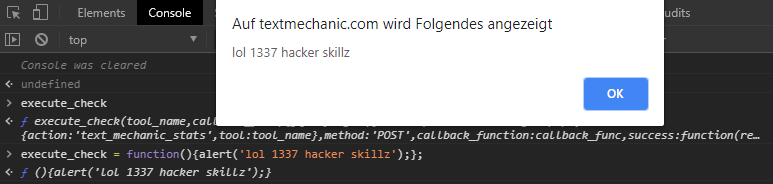

## Hacking Websites with JavaScript - Part 1

10/12/2018

This post is part of a multi-part Series where I write about fun things you can do with just some JS and a modern day browser. Part 1 is about getting Free Premium Features on [textmechanic.com](http://textmechanic.com/).

## What do I need?

- A browser. I will be using chrome
- Basic understanding of programming as well as the HTTP protocol including  POST/GET requests is recommended.
- Creativity.

## What do we want to do?

Part 1 will be about bypassing the premium paywall on [textmechanic.com](http://textmechanic.com/). If you don't know textmechanic: It's a website that offers various text manipulation tools such as removing duplicate lines, comparing lists for differences, removing whitespace, adding suffixes and prefixes and much more. I use that site every now and again when I need to do some filtering and sorting of massive CSV files. Now, one day, I was seeing **this**:


I already whitelisted the site in uBlock after the site showed ADs. I was fine with that. If that would've been a one time 10$ charge I would have even consider paying it, but this paying monthly thing was way too much for me.

Considering nearly all stuff happens in client JS only, this site is good target for the introduction to client side JS hacking.


## The Reversing


Let's clarify something first: What is our goal? Using the site for free of course. Then how do we do that? This is where we start reversing the website.

The first things we gonna try don't even involve any code at all. We just take a look at how the site behaves when we:


- Use all Free actions
- Delete all Cookies

**Result:** I still couldn't use the Site. That tells us it does not store the anything in a cookie. So next:

- Clearing everything including Chromes localstorage
- Using FireFox

**Result:** Still, no luck. It's not saved in the browser at all. Then:

- Using a VPN
- Using my phones 4G

**Result:** *This worked*. So we definitely know the "ban" we get is applied by IP address. That tells us that the Webserver is somehow involved in the process.

Now is a good time to look into the Network Tab in the Chrome DevTools (Press f12 in chrome). After using the site for a bit, this is what I saw:


What does that mean?

1. There is a lot of random stuff like [googleAds](https://ads.google.com/home/), some stuff from [research.de](http://research.de/) (whatever that is) and more that looks like tracking and / or ADs.
2. The highlighted thing is a POST request to "admin-ajax.php". That is probably what we are looking for. Not only is it the only thing hosted locally on the textmechanic server but it also has ajax in the name. How sweet! 

So the request includes two fields of data:

- ACTION
  - I don't exactly know what that is supposed to do, seems to be required so the admin.ajax.php knows what function to actually call.
- TOOL
  - This is the "tool" I used on the Site. In this case I added an prefix to some random text. 


As any request also contains our IP address (obvisously, because we just send some data to it), we have given the server all the data it needs to limit us by IP address.

Let's look at the response we got now:


So on the left is the part of the website telling us that we have 2 "uses" already done (it started at 0), and the response also tells us our uses are at '2'.

Proving that this is the right thing we are looking at.

There is also something called status, that has the value 'OK'. Let's use up all free uses and see what happens:


*Okay* we have something interesting going on here:

- Uses are at 4 which gave us the dreaded warning
- The status is now 'ERROR'
- The server responded with the time we have to wait until we can continue again.

That is all we need to know. Actually that's a bit more than we really *need* to know, but whatever. Now for the fun part.

## Manipulating the Code

So we have a decent understanding of what is happening now. All that is left to do is stopping that from happening. There are many ways to approach this, I will just share what I did in this case.

I know there is a AJAX request happening. I also know, that all the text manipulation is done in client d Side JS. That is because:

1. The Network Tab didn't show anything regarding the actual Text manipulation
2. Some parts of the code I looked at browsing the Sources did.
3. The site also literally tells you that it does everything client side.

My first Idea than was to just **NOT DO** the AJAX request. And that's exactly what I did! Honestly that's a pretty straight forward process:

- Find the code
- Understand the code
- Replace the code

To find the code we need, I switch over to the sources tab and use "search in all files" to search for the string 'admin-ajax.php':


And I find this string in this function right here:


Now (after[ pretty printing](https://en.wikipedia.org/wiki/Prettyprint#Programming_code_formatting_and_beautification) the code; It was minified) we found the golden nugget! Take some time and read the code, try to understand it yourself if you can. 

If you know what callbacks are you probably already know what to do from here. Still, let me explain:

The "execute_check" function takes the arguments 'tool_name' and 'callback_func' which is a function passed into a function (if you don't know JS, this is very common practice here.) The function does the request, takes the response and when the status variable we saw earlier is 'ERROR' it will show the error window. Otherwise it will execute the "callback_func".

But...what is "callback_func" even doing? Well let's use the debugger and take a peek at the scope:


We see two things here:

- The "callback_func" is (in this case) called 'removelinebreaks'. I was using the tool remove line breaks. So that definitely checks out.
- Also the whole function "execute_check" exists in the globally accessible scope "window". So it's extremely easy to overwrite.

So by just removing the code that does the request, or even just changing the IF clause, we get what we want.

Let's test that:



What I did here is, that I opened the console, which allows me to interact with the sites JavaScript. I first entered the function name "execute_check" and can confirm that it returns the above discovered function. This proves that it *is* globally accessible. Now I replaced the content of the function with  


```
alert('lol 1337 hacker skillz');
```

and clicked the "REMOVE LINE BREAKS" button. So we changed the functions behaviour to do whatever we want! We successfully manipulated the sites code and behaviour.

## Actually Hacking stuff and achieving persistence

This is the last part of our Hack. We can now change the code we need to change, but it still doesn't do anything useful as of right now. Also, no one wants to redo the whole process every single time visiting the website, so we also have to look into *persistence.*

First off, let's replace the function with useful code this time to achieve our goal. All we need to do is remove everything that we don't need from the original function while keeping it working:


It's very simple. First, we accept the same function arguments as the original function. This function gets called from several places with **always** the same arguments. So if we dont leave that like it is, we break the script. We don't actually need 'tool_name' but still take it as an argument so the script works when it tries to pass these arguments. Then we just call the "callback_func" without ever performing every check like the original function did. That's about it. 


Now the last thing left to do is **persistence.** There are two ways I consider good enough.

The first is using a chrome snippet. Read more about that *here*

Personally though, I recommend using UserScripts and a UserScript manager. Chrome has [Tampermonkey](https://chrome.google.com/webstore/detail/tampermonkey/dhdgffkkebhmkfjojejmpbldmpobfkfo?hl=en) and FireFox has [Greasemonkey](https://addons.mozilla.org/en-US/firefox/addon/greasemonkey/). Main Advantages are that these run scripts automatically on the site it needs to, offer one-click installs, are auto updating the scripts and give feedback when scripts are running.


If you are using a UserScript manager now, click [HERE](https://gist.github.com/p410n3/94f01e8b94e0d22a207bfa24a3cd5aa8/raw/4e3f7da2917bef92c16bd8d0d4bb6dbe28239bff/textmechanic-free-premium.user.js) to install my script that gives you free premium on [textmechanic.com](https://textmechanic.com/).

I hope that article was easy enough to follow, if you have any ideas, critique or anything else, feel free to write me a mail to [p410n3@gmail.com](mailto:p410n3@gmail.com)

### Thanks for reading!
