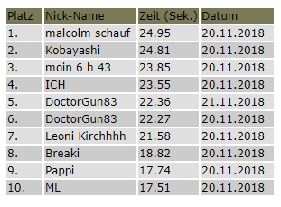

## Hacking Websites with JavaScript - Part 2

11/21/2018

This is Part 2 of my Series about unconventional usage of JavaScript. Please read [part 1](https://blog.palone.top/detail/news/hacking-websites-with-javascript-part-1/) first if you haven't already, as I will write this second part less noob friendly.

This time I will take a look at a JavaScript powered game, which features a Online Leaderboard to show off your 1337 Hacker Skills to the world.

The website I will be using for that is <https://www.bernhard-gaul.de/spiele/reaktion/reaktion2.php>

With that out of the way, let's just start:

## 1) The Game


This is what the game looks like. You hold the Left MB to drag the red block around, evading the blue thingies flying around. This game can be found at various places, but I am not sure if the Leaderboard functionality was added by this particular website or the original game coder. Whatever may be the case, let's start to reverse some stuff.


## 2) The easy way


The easy way is... really easy. 

When we just open the Source tab we see a Reaktionstest.js *(ENG: Reactiontest.js)*


This game is so simple that we don't really need to run it to understand what's going on. Before you do any testing though, be aware that the game runs in an iFrame. You have to make sure your console is in the right context:


You can do many things. Disabling the collision detection is one of the simpler ones.

Frankly, this is so easy, I am not gonna show it in Detail. Just look at some of the functions and replace some stuff.


## 3) Network Requests

Now this is the fun part! Skip all the actual gameplay and go straight for the Leaderboard. The Highscore obviously has to be submitted *somehow*. It is probable that this game uses plain old HTTP requests, newer games may use Websockets. Let's try to submit a score and see what our Chrome Dev Tools say:


So this is the relevant POST request. Let's look at the fields one by one:

- nzeit
  - Translated this means "nTime". Basically the score.
- user
  - The username I submitted
- nHidden
  - Not sure at this point, this looks like some protection
- Submitprompt
  - This was the Text in the prompt. I found out later that this tells the server what there is to do.

Also noteworthy is the fact that the site loads the file "Blowfish.js" which is a JS implementation for a very popular and safe encryption cipher. Probably in relation to the "nHidden" thing?

Let's forget this for now and just copy one request and resend with a higher score. You can right click any request and select "Copy -> Copy as Fetch" to get JS code with the request ready to paste into the console.


The Server takes it. However, the first legitimate Request triggered a reload of the page. This time the response is completely empty. Did it work? Let's refresh



Nope.

So let's look for referneces to "nHidden" and see whats going on. This is what we find:

 

```
<input name="nhidden" id="ihidden" type="hidden" />
```

 

It's a empty hidden input field. Not suprising given the name. The id of "iHidden" then probably is referred to in the JS. Basically, if you dont worked a lot with JS before, the default way to select a single node in the Websites DOM is to use the function

 

```
document.getElementById()
```

 

Let's search for that:


So the openResult() function opens the dialog to submit the Score. Our "ihidden" value comes from the variable "x.versch". Let's see where *this* comes from.


Ooooh. There's some crypto going on. The counter, which I assume is the time, get's encrypted with "check" which is some other stuff...?

What are all these values, and what's the result? Let's set a breakpoint to find out.


These are the arguments for the encrypt() function. The key "aeiou" is hardcoded above, so it's our score and a secret key thats used here.

*(PRO TIP: Don't hardcode secret keys where everyone can grab them)*

And here is the value after encrypt() happened.


Looks familiar right?

So to set any score we want, we have to encrypt our desired value and adjust the request acordingly. The server then checks if these values are the same.


Luckily, the function is in the Global Scope! *(IF you have your console in the right context as mentioned above).*

So I can just pop some score in to get my values and theres no need to use additional tools.


The body of the request now looks like that:

 

```
"body": "nzeit=25.55&user=skills1337&nhidden=AAh02gAL5DG3DXgj7H0AeQ%3D%3D&submitprompt=In+die+Rangliste+eintragen",
```

 

Note how the '=' is URL encoded with %3D%3D as using the actual '=' char, would make this an invalid request.


Works! I can freely set my score now. Topping things off, we could write a UserScript for that so we dont have to deal with breakpoints the next time. But I am too lazy for that right now.

I have found out a couple additional things as well. It seems that every score over > 27 seconds get rejected. I was however able to set the score to 26.999 (normally impossible) and 26.9999999999 which gets rounded to 27. That means we can achieve scores that are impossible using the actual game.


This raises suspicion that this site might actually be vulnerable to XSS. Anything that's not a normal number seems to be disregarded, but there may be ways around that.

Further testing revealed that users are distinguished by IP address.

That all for now.


### Thanks for reading
