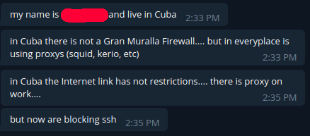

## Bypassing Firewalls - But why?

Oh boy here goes. This is the first post of many, in which I will touch
the topic of bypassing Firewalls. This being the Introduction of this
series, I will focus on setting the topic up, providing explanations and
all that stuff.

Some of the resources I will provide are screenshots from chats I took
in the [Telegram Messenger](https://telegram.org/ "Telegram"). I've had
many and very lenghty converstaions with a some very awesome individuals
over the past few months. These people all have a need to bypass
Firewalls on a daily basis. I was also lurking around in subreddits and
forums where people are discussing that topic.

### So why?

First things first, **WHY** would anyone need to *bypass* a firewall?
Firewalls are mostly perceived as a security measure. They are installed
on your endpoint machine or in the network, or... well both, and they
make sure no malware reaches your PC. And while this is not exactly
wrong, that isn't completely true either.

Because my english sucks, here is the first definition from Wikipedia:

> In computing, a firewall is a network security system that monitors
> and controls incoming and outgoing network traffic based on
> predetermined *security* rules.

That's pretty accurate so far, although I would personally cross out the
word 'security'. Because Firewalls are also commonly used to *censor*
and *surveil* the users that sit behind it. The most famous example for
that is probably the [Great Firewall of
China](https://en.wikipedia.org/wiki/Great_Firewall "GFW") (GFW). It's
the wet dream of any totalitarist leader in the modern world, and a very
powerful tool in shielding away reality from citizens for the purpose of
propaganda. But I might write more about the GFW another day.

I am also in contact with a couple of folks from Iran, a country which
has a form of internet censorship which is similar to China. The freedom
of chinese and iranian people is actively limited by their oppresive
governments, bypassing the censorship machine means liberation!

See, I am not in china, neither am I chinese. I am very privileged to
live in a country where I mostly have free access to any kind of
information I desire. Therefore, the GFW is nothing I personally have to
fear. But there are more reasons so even someone like
me might have genuine interest in bypassing firewalls. Even though my
freedom is not limited by my government.

### Less dramatic reasons for bypassing Firewalls

A classical example why one wold want to bypass a firewall, are
free WiFi Hotspots. Germany\'s mobile network is **trash**. And
expensive too. So when I can, I use open WiFi Hotspots. Now these aren't
often the safest option out there, and some of them are straight up
nefarious. I was in a Subway the other day, the one where you get
sandwiches, and after connecting to the WiFi my browser was barfing all
sorts of SSL error messages out. This network actually deployed their
own Certificate, which would break the encryption of any HTTPS site if
used. They could straight up log my internet activity. We are in 2019,
and I am sure that violates the GDPR and probably other laws, but
whatever. Who cares about data protection laws right?

I have no idea *why *they do that. As far as I am concerned it may just
be a misconfiguration. *Maybe*.

One argument now could be, just to not connect to such a network in the
first place. And sure, I could. Fair point. But I can also use a VPN and
continue using free WiFi while eating my damn fastfood.

Another thing happenend at my school. It deploys a network filter, like
many schools do. What sucks is that they block
[web.de](https://web.de "web.de"), amongst many other sites. Web.de is a
webmail provider that also delivers news. These news are very clickbaity
and generally low quality, and I guess that is why the school has
blocked it. (Although it was listed under 'pornography' which
was odd.) Now as luck would strike me, I had to reset a password. Mail
sent to my web.de Account. Well, I was able to get to my mails, because
I could bypass the restriction that was set by the firewall. But usually
I would have not been able to.

These two examples show security and usability concerns respectively.
Avoiding the firewall means avoiding sniffing and restrictions.

I  was also chatting with a guy from Cuba. Take a look at what he wrote
to me:

Now it gets comical. That guy is a SysAdmin. One would think using SSH
is useful for such a person.

### Okay and... how?

After I have (hopefully) made clear why there are many reasons to bypass
Firewalls, what remains is the question **how** to bypass them. And
this, dear reader, will be in the next blog post.

In the meantime, anyone who is interested in that topic can [write me a
PM](https://t.me/pallip "PM me on Telegram") on telegram, and when there
is a genuine interest, come and join [this Telegram
group](https://t.me/privacynsecurity "TG Group") and chat with me and
others about this topic.

### Thanks for reading and **Fuck Firewalls**
